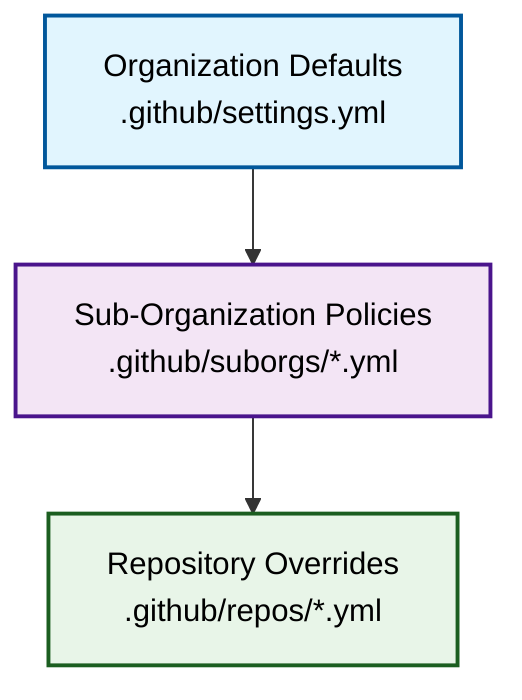
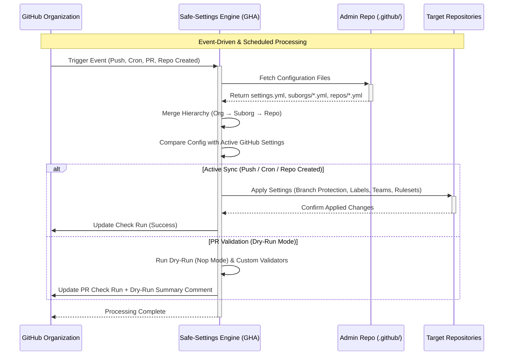

<!-- Don't delete it -->
<div name="readme-top"></div>

<!-- Organization Logo -->
<div align="center" style="display: flex; align-items: center; justify-content: center; gap: 16px;">
  
</div>

&nbsp;

<!-- Organization/Project Social Handles -->
<p align="center">
<!-- Telegram -->
<a href="https://t.me/StabilityNexus">
</a>
&nbsp;&nbsp;
<!-- X (formerly Twitter) -->
<a href="https://x.com/aossie_org">
</a>
&nbsp;&nbsp;
<!-- Discord -->
<a href="https://discord.gg/hjUhu33uAn">
</a>
&nbsp;&nbsp;
<!-- LinkedIn -->
<a href="https://www.linkedin.com/company/aossie/">
  </a>
&nbsp;&nbsp;
<!-- Youtube -->
<a href="https://www.youtube.com/@AOSSIE-Org">
  </a>
</p>

---

<div align="center">
<h1>🛡️ AOSSIE Admin Repository (Safe-Settings Policy-as-Code)</h1>
</div>

The **`admin`** repository centrally manages and enforces repository policies, branch protection rules, issue labels, team access permissions, custom properties, rulesets, and environments across all public repositories in the **[AOSSIE](https://github.com/AOSSIE-Org)** organization.

> [!NOTE]
> This repository strictly adheres to the official **[GitHub Safe-Settings](https://github.com/github-community-projects/safe-settings)** specification (`main-enterprise` branch), utilizing standard GitHub Actions workflows ([docs/github-action.md](https://github.com/github-community-projects/safe-settings/blob/main-enterprise/docs/github-action.md)) for policy evaluation, dry-run PR checks, and scheduled drift prevention.

---

## 🚀 Key Features & Capabilities

- **Centralized Policy-as-Code**: Store and manage all organization settings in Git-tracked YAML configuration files under `.github/`.
- **Three-Tier Precedence Hierarchy**: Precedence order `Repository > Sub-Organization > Organization` allows domain-specific customization while enforcing global compliance.
- **Dry-Run PR Validation (Nop Mode)**: When a PR is opened in `admin`, safe-settings runs in dry-run mode to evaluate and validate proposed policy changes before merging.
- **Scheduled Drift Prevention**: Automated GitHub Actions (`.github/workflows/safe-settings-sync.yml`) run on a 4-hour schedule to prevent manual configuration drift in GitHub.
- **Restricted Scope Protection**: Configured via `deployment-settings.yml` (`restrictedRepos`) to safeguard core administrative repositories (`admin`, `.github`, `safe-settings`) from unintended bot operations.
- **Fine-Grained Glob Scoping**: Supports `include` and `exclude` glob patterns for scoping teams, labels, collaborators, and repository lists.
- **External Status Checks Preservation**: Supports `{{EXTERNALLY_DEFINED}}` token under status checks to allow external CI checks configured via the GitHub UI.

---

## 📊 Visual Architecture & System Flows

### Configuration Precedence Hierarchy



**Precedence Order**: `Repository > Sub-Organization > Organization`

### System Request & Processing Flow



---

## 📁 Repository Directory Structure

```
admin/
├── deployment-settings.yml           # Defines restrictedRepos (admin, .github, safe-settings)
├── .coderabbit.yaml                  # CodeRabbit AI code review configuration for policy repo
├── .github/
│   ├── settings.yml                  # Organization-wide settings (default branch protection, labels, teams)
│   ├── suborgs/                      # Sub-organization policies (grouped by domain)
│   │   ├── ai-agentic-tools.yml
│   │   ├── blockchain-web3.yml
│   │   ├── web-frontend.yml
│   │   ├── education-learning.yml
│   │   ├── mobile-apps.yml
│   │   └── core-infra.yml
│   ├── repos/                        # Repository-specific override files
│   │   └── admin.yml
│   ├── workflows/
│   │   └── safe-settings-sync.yml    # GitHub Actions workflow for scheduled full-sync
│   └── dependabot.yml                # Dependabot configuration (monitoring github-actions)
├── public/
│   └── aossie-logo.svg
└── README.md                       
```

---

## 🏛️ Sub-Organization Domain Breakdown

All public repositories in **AOSSIE-Org** are grouped into 6 sub-organization policy categories:

| Sub-Org Domain | Description | Key Managed Repositories |
| :--- | :--- | :--- |
| **`ai-agentic-tools`** | AI agents, LLMs, Discord bots, PR analyzers, and automated assistants | `SkillBot`, `PullRequestDashboard`, `Skills`, `OpenVerifiableLLM`, `CodingAgent`, `Gitcord`, `EduAid`, `DebateAI` |
| **`blockchain-web3`** | Decentralized apps, smart contracts, and Web3 dashboards | `Djed-Solidity-WebDashboard`, `IndexedDB-Import-Export` |
| **`web-frontend`** | Web applications, dashboards, frontend components, and social widgets | `OrgExplorer`, `SocialShareButton`, `SupportUsButton`, `Website`, `Resonate-Website`, `PictoPy-Website` |
| **`education-learning`** | Educational tools, Rust ML bindings, knowledge bases | `Social-Street-Smart`, `SciKitLearn-Rust`, `Info`, `LibrEd` |
| **`mobile-apps`** | Android, Flutter, iOS, and cross-platform mobile apps | `CarbonFootprint-Mobile`, `Starcross-Android`, `Agora-Android`, `Agora-iOS`, `Resonate`, `Monumento`, `PictoPy` |
| **`core-infra`** | Core infrastructure, template repositories, blogs, and org tools | `admin`, `Template-Repo`, `.github`, `AOSSIE-Blogs`, `ContributorAutomation`, `Scavenger`, `Skeptik` |

---

## ⚙️ Configuration Specification Guide

### 1. Organization Defaults (`.github/settings.yml`)
Applies globally to all repositories unless overridden by a suborg or repo file:
```yaml
repository:
  has_issues: true
  has_projects: true
  allow_squash_merge: true
  delete_branch_on_merge: true

branches:
  - name: main
    protection:
      required_pull_request_reviews:
        required_approving_review_count: 1
        dismiss_stale_reviews: true
      required_status_checks:
        strict: true
        contexts: []
      required_conversation_resolution: true

labels:
  - name: "bug"
    color: "d73a4a"
  - name: "gsoc"
    color: "f9d0c4"

teams:
  - name: admins
    permission: admin
  - name: maintainers
    permission: push
```

### 2. Sub-Organization Policies (`.github/suborgs/*.yml`)
Defines policies for a collection of repositories specified in `suborgrepos` (supports glob patterns like `test*`):
```yaml
suborgrepos:
  - "SkillBot"
  - "PullRequestDashboard"
  - "Skills"

repository:
  has_issues: true
```

### 3. Repository Overrides (`.github/repos/<repo-name>.yml`)
Applies specific overrides for a single repository (e.g. `admin.yml` enforcing strict 2-reviewer approvals):
```yaml
branches:
  - name: main
    protection:
      required_pull_request_reviews:
        required_approving_review_count: 2
        require_code_owner_reviews: true
      enforce_admins: true
```

### 4. Scope Restrictions (`deployment-settings.yml`)
Controls which repositories safe-settings can manage or exclude:
```yaml
restrictedRepos:
  - admin
  - .github
  - safe-settings
```

---

## 🛠️ Policy Change Workflow

1. Create a branch and modify policy files in `.github/settings.yml`, `.github/suborgs/`, or `.github/repos/`.
2. Open a Pull Request. Safe-settings automatically runs in **dry-run mode** (`nop` mode) to evaluate proposed changes and posts a validation report.
3. Upon approval and merge to `main`, the `.github/workflows/safe-settings-sync.yml` workflow triggers and applies the settings live across target repositories.

---

## 📍 License

This project is licensed under the **GNU General Public License v3.0**. See the [LICENSE](LICENSE) file for details.

© 2026 **AOSSIE**
